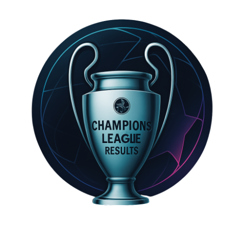
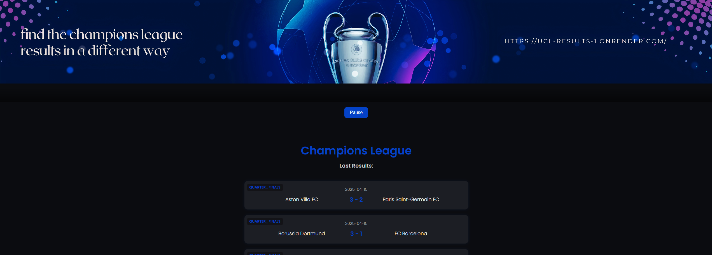

    

## UCL Results

A small web app that shows the latest UEFA Champions League results — with style.
At the top of the page, you can click a button to play the iconic Champions League anthem, setting the mood like it’s matchday night. ⚽🎶

This was my first project using an API, HTML, and CSS. I'm just a student in my first semester, exploring new technologies and trying to build things around what I love.

🔗 Live site: https://ucl-results-1.onrender.com/

🛠 Tech Stack

Frontend: HTML + CSS

Backend: Python + Flask

API: Football-Data.org

Deployment: Render

Version control: Git + GitHub

## Features

📡 Live UEFA Champions League results, fetched from Football-Data.org

🎵 Play the Champions League anthem by clicking a button

📱 Responsive design, works on desktop and mobile

💻 Lightweight Flask backend

👶 First project using API, HTML, CSS — built with curiosity and passion

## About Me

I'm a student in my first semester of tech studies.
This was a small project to dive into APIs, Flask, HTML/CSS, and deploying apps online.
I wanted to combine learning with something I love: football.
Not perfect, but made with love and curiosity. 💙

